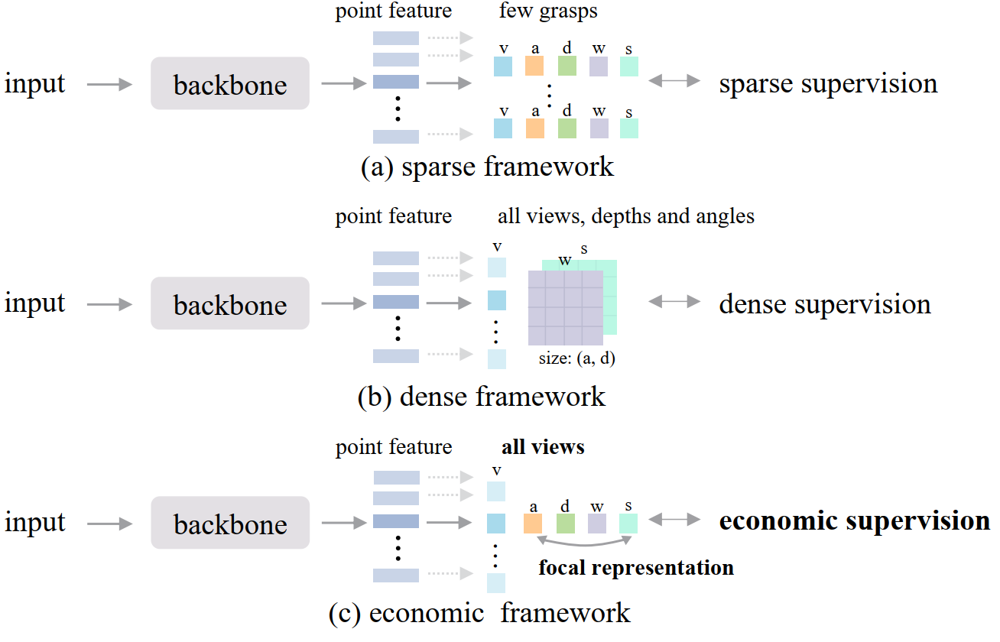

# An Economic Framework for 6-DoF Grasp Detection

Official implement of EconomicGrasp | [Paper]() | [Personal Homepage](https://dravenalg.github.io/).

**Xiao-Ming Wu&**, Jia-Feng Cai&, Jian-Jian Jiang, Dian Zheng, Yi-Lin Wei, Wei-Shi Zheng*

Accepted at ECCV 2024!

If you have any questions, feel free to contact me by wuxm65@mail2.sysu.edu.cn.

## Abstract

 Robotic grasping in clutters is a fundamental task in robotic manipulation. In this work, we propose an economic framework for 6-DoF grasp detection, aiming to economize the resource cost in training and meanwhile maintain effective grasp performance. To begin with, we discover that the dense supervision is the bottleneck that severely encumbers the entire training overload, meanwhile making the training difficult to converge. To solve the above problem, we first propose an economic supervision paradigm for efficient and effective grasping. This paradigm includes a well-designed supervision selection strategy, selecting key labels basically without ambiguity, and an economic pipeline to enable the training after selection. Furthermore, benefit from the economic supervision, we can focus on a specific grasp, and thus we devise a focal representation module, which comprises an interactive grasp head and a composite score estimation to generate the specific grasp more accurately. Combining all together, the EconomicGrasp framework is proposed. Our extensive experiments show that EconomicGrasp surpasses the SOTA grasp method by about 3AP on average, and with extremely low resource cost, for about 1/4 training time cost, 1/8 memory cost and 1/30 storage cost. Our code will be published.

## Overall



## How to Run

### Dependencies Installation

The installation process is a little complex, please follow the order to ensure successful installation. We also write a [file](common_issues.md) to describe some common issues of the installation.

#### MinkowskiEngine

Install MinkowskiEngine following the Anaconda installation in https://github.com/NVIDIA/MinkowskiEngine.
About the pytorch version, we should download the pytorch match your cuda driver (torch.cuda.is_available() = True).

```bash
conda install openblas-devel -c anaconda
conda install pytorch=1.9.0 torchvision cudatoolkit=11.1 -c pytorch -c nvidia
git clone https://github.com/NVIDIA/MinkowskiEngine.git
cd MinkowskiEngine
python setup.py install --blas_include_dirs=${CONDA_PREFIX}/include --blas=openblas
```

#### Pip Dependency

Install dependent packages via Pip.

```bash
pip install -r requirements.txt
```

#### PointNet2

Compile and install pointnet2 operators (code adapted from [votenet](https://github.com/facebookresearch/votenet)).

```bash
cd pointnet2
python setup.py install
```

#### KNN 

KNN is use for dataset generation. Compile and install knn operator (code adapted from [pytorch_knn_cuda](https://github.com/chrischoy/pytorch_knn_cuda)).

```bash
cd knn
python setup.py install
```

#### PyTorch3D

Download the PyTorch3D version meet your PyTorch version from [PyTorch3D](https://github.com/facebookresearch/pytorch3d/releases).

```bash
tar -zxvf pytorch3d-0.7.2.tar.gz
cd pytorch3d-0.7.2/
python setup.py install
```

#### graspnetAPI 

GraspnetAPI is used for dataset generation. Install graspnetAPI for evaluation.

```bash
git clone https://github.com/graspnet/graspnetAPI.git
cd graspnetAPI
pip install .
```

### Graspness Generation

Point level graspness label are not included in the original dataset, and need additional generation. Make sure you have downloaded the orginal dataset from [GraspNet](https://graspnet.net/). The generation code is in [dataset/generate_graspness.py](dataset/generate_graspness.py).
```bash
cd dataset
python generate_graspness.py --dataset_root /data/graspnet --camera_type kinect
```

### Sparse Dataset Generation

### Training

### Testing

## Results


## Citation
```
